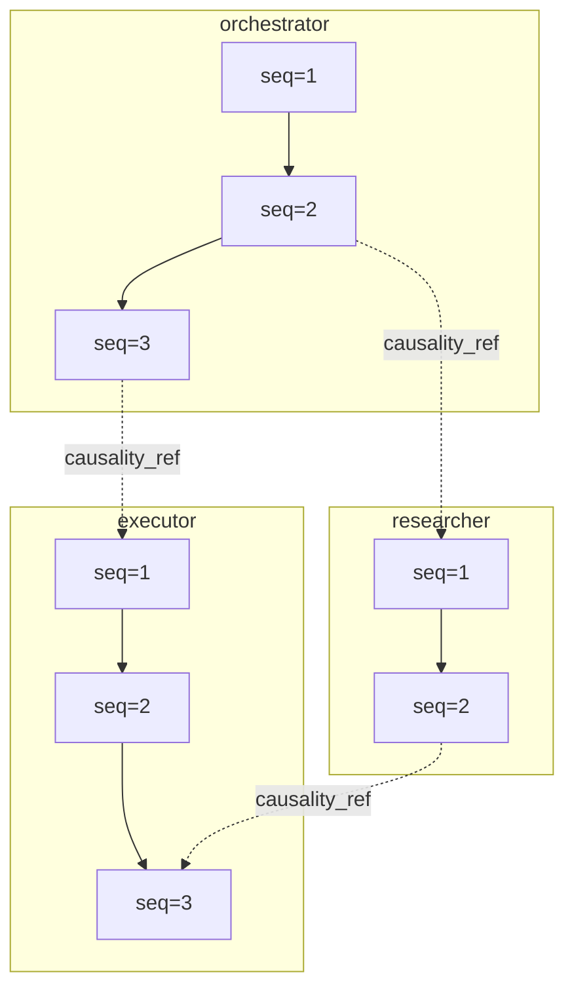

# AI Governance Proof (AIGP)&trade;

[](./LICENSE)
[](./spec/aigp-spec.md)
[](./schema/aigp-event.schema.json)
[](./integrations/opentelemetry/semantic-conventions.md)
[](./integrations/openlineage/semantic-conventions.md)

**An open specification for capturing cryptographic proof of every AI agent governance action.**

AIGP is not a product feature — it's a proposal for a common language that any platform, framework, or organization can adopt. We don't claim it's the final answer. We offer it as a starting point, and we welcome anyone who wants to help shape it.

---

## Contents

- [Why AIGP?](#why-aigp)
- [Repository Topology](#repository-topology)
- [Quick Start](#quick-start)
- [Core Schema](#core-schema)
- [Event Types](#event-types)
- [Use Cases](#use-cases)
- [Instrumentation Conventions](#instrumentation-conventions)
- [Example Event](#example-event)
- [OpenTelemetry Integration](#opentelemetry-integration)
- [OpenLineage Integration](#openlineage-integration)
- [CloudEvents Transport](#cloudevents-transport)
- [Reference Implementation](#reference-implementation)
- [Known Gaps and Open Work](#known-gaps-and-open-work)
- [Contributing](#contributing)

---

## Repository Topology

AIGP now uses a split-repository model:

| Repository | Role |
|---|---|
| `open-aigp/aigp` | Normative specification, schemas, and conformance fixtures |
| `open-aigp/aigp-sdks` | Language SDK implementations (Python, TypeScript, Go, Rust, Java, Kotlin, .NET) |
| `open-aigp/aigp-tools` | Verifier CLI, audit viewer UI, and report/export tooling |

This repository remains the source of truth for specification and schema evolution.
The local `sdks/` directory in this repo is a transition mirror and SHOULD NOT be treated as the canonical SDK source.

---

## Why AIGP?

AI agents are being deployed across every industry. They access company data, make decisions, and interact with customers. Regulators, auditors, and security teams all need to answer the same fundamental question:

> **"Prove your AI Agents used the approved Prompts, Tools, and Policies—every single time."**

Today, every team answers this differently. Some grep through logs. Some build custom audit tables. Some don't track it at all. There is no shared format for what an AI governance proof should look like.

AIGP is a structured, cryptographic event format that captures **what happened**, **who did it**, **what data was involved**, and **whether it was allowed**.

---

## 30-Second Integration

Pick one SDK and run one snippet:

### Python

```bash
pip install aigp
```

```python
from aigp import AIGPInstrumentor

event = AIGPInstrumentor(agent_id="agent.my-bot").emit(
    "INJECT_SUCCESS",
    policy_name="policy.trading-limits",
    policy_version=4,
    content="Max position: $10M",
)
print(event["event_id"], event["governance_hash"])
```

### TypeScript

```bash
npm install @aigp/sdk
```

```ts
import { emitAIGPEvent } from "@aigp/sdk";

const event = emitAIGPEvent({
  event_type: "INJECT_SUCCESS",
  event_category: "inject",
  agent_id: "agent.my-bot",
  policy_name: "policy.trading-limits",
  policy_version: 4,
  content: "Max position: $10M",
});
console.log(event.event_id, event.governance_hash);
```

### Go

```bash
go get github.com/open-aigp/aigp-sdks/go
```

```go
package main

import (
	"fmt"

	aigp "github.com/open-aigp/aigp-sdks/go"
)

func main() {
event, _ := aigp.EmitAIGPEvent(aigp.CreateEventOptions{
	EventType:     "INJECT_SUCCESS",
	EventCategory: "inject",
	AgentID:       "agent.my-bot",
	PolicyName:    "policy.trading-limits",
	PolicyVersion: 4,
}, "Max position: $10M")
fmt.Println(event.EventID, event.GovernanceHash)
}
```

Success looks like:
- `event_id` is a UUID
- `governance_hash` is 64-char lowercase hex
- `trace_id` is present

### Python Golden Path (`govern(agent).run(...)`)

```python
from aigp import AgentGPConfig, govern

runner = govern(
    AgentGPConfig(
        base_url="https://api.agentgp.ai",
        api_key="sk-...",
        agent_id="agent.my-bot",
        strict=True,
        required_prompts=["prompt.support-v3"],
        required_policies=["policy.content-filter"],
        required_tools=["tool.search"],
    )
)

result = runner.run(
    {"question": "How do I reset my password?"},
    prompt_name="prompt.support-v3",
    policy_name="policy.content-filter",
    tools=["tool.search"],
)
print(result.trace_id, result.governance_hash, result.allowed)
```

The runner auto-handles register -> prompt -> policy -> tool -> audit-proof flow and emits AIGP events with automatic `trace_id`, `sequence_number`, and `causality_ref`.

Live docs: [open-aigp.org](https://open-aigp.org). Repository docs source: [`docs/`](./docs/).
AgentGP golden-path API contract: [`docs/agentgp-golden-path.md`](./docs/agentgp-golden-path.md).

---

## Developer and Product Lens

| Audience | What AIGP gives you quickly |
|---|---|
| Application developers | One event shape and SDK parity across languages with transport/vendor independence |
| Platform teams | A consistent proof envelope (`trace_id`, `sequence_number`, `causality_ref`, `governance_hash`) that works across frameworks |
| Security and audit teams | Deterministic verification paths for signatures, Merkle roots, and causal continuity |
| Product and compliance leaders | A reusable, open governance proof contract that can be audited without lock-in to one runtime |

For auditor report integration, use: [`schema/aigp-verifier-report.schema.json`](./schema/aigp-verifier-report.schema.json).

---

## AIGP Loves Open Standards

AIGP is inspired and designed to integrate with open standards, not compete with them.

AIGP does not replace OpenTelemetry, OpenLineage, or CloudEvents. It composes with them.
For governance proof, AIGP plays a role similar to what OpenTelemetry plays for observability: a shared, implementation-neutral standard.

| Concern | Standard | What it answers |
|---|---|---|
| Observability | OpenTelemetry | What was slow, failed, retried, or overloaded? |
| Governance Proof | AIGP | What governed this agent action, and can it be cryptographically verified? |
| Data Lineage | OpenLineage | What data moved where, and through which systems? |
| Event Transport | CloudEvents | How are events packaged and routed between systems? |

- **W3C Trace Context**: AIGP reuses `trace_id`, `span_id`, and `trace_flags` for end-to-end correlation.
- **OpenTelemetry**: AIGP dual-emits governance proof alongside operational spans.
- **CloudEvents**: AIGP events can ride a standard event envelope for interoperable routing.
- **OpenLineage**: AIGP attaches governance context to lineage via open facets.
- **JSON Schema + Protobuf**: AIGP keeps open, language-neutral contracts for validation and codegen.

---

## Quick Start

An AIGP event is a single JSON record that captures proof of one governance action. Any system can produce them — just emit JSON:

```python
import json, hashlib, uuid, datetime

def create_aigp_event(agent_id, policy_name, content, trace_id):
    return {
        "event_id": str(uuid.uuid4()),
        "event_type": "INJECT_SUCCESS",
        "event_category": "inject",
        "event_time": datetime.datetime.utcnow().isoformat() + "Z",
        "agent_id": agent_id,
        "policy_name": policy_name,
        "policy_version": 1,
        "governance_hash": hashlib.sha256(content.encode()).hexdigest(),
        "trace_id": trace_id,
        "sequence_number": 1,
    }

# Emit the event to your log, message bus, or any store
event = create_aigp_event("agent.trading-bot", "policy.trading-limits", "Max position: $10M", "trace-001")
print(json.dumps(event, indent=2))
```

That's it. No SDK required, no vendor lock-in. If your event conforms to the schema, it's AIGP-compliant.

---

## SDK Status

| SDK | Status | Notes |
|-----|--------|-------|
| Python (`aigp-sdks/python`) | Active | Reference SDK with event creation, OTel bridge, CloudEvents, OpenLineage helpers, decorators |
| TypeScript (`aigp-sdks/typescript`) | Active (Core) | Event creation, Merkle + inclusion proofs (`leaf_hash` + `proof_path`), signer boundary, reliability helpers, CloudEvents |
| Go (`aigp-sdks/go`) | Active (Core) | Event creation, Merkle + inclusion proofs (`leaf_hash` + `proof_path`), signer boundary, reliability helpers, CloudEvents |
| Rust (`aigp-sdks/rust`) | Active (Core) | Event creation, Merkle + inclusion proofs (`leaf_hash` + `proof_path`), signer boundary, reliability helpers, CloudEvents |
| Java (`aigp-sdks/java`) | Active (Core) | Event creation, Merkle + inclusion proofs (`leaf_hash` + `proof_path`), signer boundary, reliability helpers, CloudEvents |
| Kotlin (`aigp-sdks/kotlin`) | Active (Core) | Event creation, Merkle + inclusion proofs (`leaf_hash` + `proof_path`), signer boundary, reliability helpers, CloudEvents |
| .NET (`aigp-sdks/dotnet`) | Active (Core) | Event creation, Merkle + inclusion proofs (`leaf_hash` + `proof_path`), signer boundary, reliability helpers, CloudEvents |

---

## Core Schema

Every AIGP event has these required fields. The full schema (25+ fields) is in the [formal specification](./spec/aigp-spec.md).

| Field | Type | Description |
|-------|------|-------------|
| `event_id` | UUID | Unique identifier for this event |
| `event_type` | String | What happened (`INJECT_SUCCESS`, `POLICY_VIOLATION`, etc.) |
| `event_category` | String | Grouping (`inject`, `audit`, `agent-lifecycle`, etc.) |
| `event_time` | DateTime | When the governance action occurred (UTC, ms precision) |
| `agent_id` | String | The agent that triggered this action |
| `governance_hash` | String | SHA-256 hash of the governed content — the cryptographic proof |
| `trace_id` | String | Distributed trace ID for end-to-end correlation |
| `sequence_number` | Integer | Monotonic ordering counter per (`agent_id`, `trace_id`), starting at 1 |

Optional but recommended: `policy_name`, `policy_version`, `prompt_name`, `prompt_version`, `data_classification`, `org_id`, `denial_reason`, `severity`, `annotations`, `spec_version`.

> **Full schema:** [`spec/aigp-spec.md`](./spec/aigp-spec.md) | **JSON Schema:** [`schema/aigp-event.schema.json`](./schema/aigp-event.schema.json)

### Ordering Model (`sequence_number` + `causality_ref`)

`sequence_number` enforces in-agent order within one trace. `causality_ref` links cross-agent dependencies as a DAG.



For a full, color-coded audit-viewer topology with findings guidance, see [`docs/audit-viewer.md`](./docs/audit-viewer.md).

### Design Principles

1. **Open and protocol-agnostic.** Works with A2A, MCP, REST, gRPC, or anything else. The format doesn't assume a transport.
2. **Tamper-evident by default.** Every event includes a `governance_hash`. If content changes between creation and storage, the hash won't match.
3. **Traceable end-to-end.** Every event carries a `trace_id`. One query reconstructs the full chain: which agent, which prompt, which policy, what happened.
4. **Flat and queryable.** Single wide event table — no joins for governance queries. Designed for OLAP stores.
5. **Forward-compatible extensibility.** Two primitives: **Resources** (governed, hashed, in the Merkle tree) and **Annotations** (informational, unhashed). Open resource types — implementations define custom types without a spec change. Consumers ignore what they don't recognize.

### What's New in v0.13

- **Salted proof metadata** — optional Merkle leaf fields `is_salted` and `salt_ref` to support privacy-sensitive verification patterns
- **Streaming interruption proof metadata** — optional leaf fields `is_partial`, `offset_unit`, and `offset` for mid-stream block evidence
- **Auditor-ready finding taxonomy** — stable verifier finding IDs for ordering, signature, and Merkle failures
- **Verifier report schema** — machine-readable contract at `schema/aigp-verifier-report.schema.json`

### v0.13 Implementation Status

| Area | Implemented | Status |
|---|---|---|
| Privacy-preserving proof metadata | Optional `is_salted` + `salt_ref` on Merkle resources | Done |
| Streaming interruption evidence | Optional `is_partial` + `offset_unit` + `offset` on Merkle resources | Done |
| Auditor finding taxonomy | Stable IDs for ordering, signature, and Merkle findings | Done |
| Verifier report contract | JSON Schema for machine-readable verifier output | Done |
| Wire schemas | Protobuf + JSON Schema updated for v0.13 fields | Done |
| SDK ingest profile adapters | Cross-language helpers to emit current AgentGP ingest wire profile without changing canonical AIGP event shape | Done |
| Documentation and examples | Spec/README/docs/examples/changelog aligned to `0.13` | Done |

Running implementation ledger: [`docs/implementation-record.md`](./docs/implementation-record.md)

---

## Event Types

AIGP defines 31 event types across 15 categories. Implementations may extend these using the same `RESOURCE_ACTION` naming convention.

| Category | Event Types | When emitted |
|----------|------------|--------------|
| Policy Injection | `INJECT_SUCCESS`, `INJECT_DENIED` | Agent requests governed policy |
| Prompt Usage | `PROMPT_USED`, `PROMPT_DENIED` | Agent pulls an approved prompt |
| Agent Lifecycle | `AGENT_REGISTERED`, `AGENT_APPROVED`, `AGENT_DEACTIVATED` | Agent joins, is approved, or leaves |
| Policy Lifecycle | `POLICY_CREATED`, `POLICY_VERSION_APPROVED`, `POLICY_ARCHIVED` | Policy is created, versioned, or retired |
| Prompt Lifecycle | `PROMPT_VERSION_CREATED`, `PROMPT_VERSION_APPROVED` | Prompt is created or approved |
| Governance Proof | `GOVERNANCE_PROOF` | Cryptographic proof-of-delivery recorded |
| Policy | `POLICY_VIOLATION` | A governance policy is violated |
| A2A | `A2A_CALL` | Agent-to-agent protocol call |
| Memory | `MEMORY_READ`, `MEMORY_WRITTEN` | Agent retrieves from or writes to memory |
| Tool | `TOOL_INVOKED`, `TOOL_DENIED` | Agent calls or is denied a governed tool |
| Context | `CONTEXT_CAPTURED` | Pre-execution context snapshot taken |
| Lineage | `LINEAGE_SNAPSHOT` | Data lineage snapshot recorded |
| Inference | `INFERENCE_STARTED`, `INFERENCE_COMPLETED`, `INFERENCE_BLOCKED` | Agent inference lifecycle |
| Human | `HUMAN_OVERRIDE`, `HUMAN_APPROVAL` | Human-in-the-loop decisions |
| Classification | `CLASSIFICATION_CHANGED` | Data classification level changes |
| Model | `MODEL_LOADED`, `MODEL_SWITCHED` | Model identity governance |
| Boundary | `UNVERIFIED_BOUNDARY` | Governed agent interacts with ungoverned system |

---

## Use Cases

AIGP is designed to work across industries where AI agents handle sensitive data or regulated processes:

- **Financial Services** — Prove trading agents only accessed approved limits and MNPI controls were enforced (SEC, FINRA)
- **Healthcare** — Audit that patient-facing agents used HIPAA-compliant consent rules and PHI access was minimum-necessary
- **Legal** — Track which contract review agents used which prompt versions and whether attorney-client privilege rules were followed (ABA Model Rules)
- **Enterprise AI** — Provide your CISO and compliance team with a single audit trail across all AI agents, regardless of framework

---

## Instrumentation Conventions

A common event format only works if the *values inside the events* follow shared conventions. These are inspired by [OpenTelemetry Semantic Conventions](https://opentelemetry.io/docs/specs/semconv/) and adapted for AI governance.

### Resource Naming (AGRN)

Every governed resource follows a typed, kebab-case naming convention called **Agent Governance Resource Names (AGRN)**:

| Resource | Format | Example |
|----------|--------|---------|
| Agent | `agent.<kebab-name>` | `agent.trading-bot-v2` |
| Policy | `policy.<kebab-name>` | `policy.eu-refund-policy` |
| Prompt | `prompt.<kebab-name>` | `prompt.customer-support-v3` |
| Tool | `tool.<kebab-name>` | `tool.order-lookup` |
| Lineage | `lineage.<kebab-name>` | `lineage.upstream-orders` |
| Context | `context.<kebab-name>` | `context.env-config` |
| Memory | `memory.<kebab-name>` | `memory.conversation-history` |
| Model | `model.<kebab-name>` | `model.gpt4-trading-v2` |
| Organization | `org.<kebab-name>` | `org.finco` |

**Rules:** Lowercase only. Letters, numbers, and hyphens. No underscores, no double hyphens, no trailing hyphens.

### Data Classification

| Level | Value | Meaning | Example |
|-------|-------|---------|---------|
| 1 | `public` | Safe for external sharing | Product FAQ, public docs |
| 2 | `internal` | Company use only | Engineering runbooks |
| 3 | `confidential` | Need-to-know | Trading limits, customer PII |
| 4 | `restricted` | Highest sensitivity, regulatory | MNPI, pre-release financials |

### Governance Hash

The `governance_hash` is computed over the governed content at the time of delivery. It proves the exact content that was delivered — if even one character changes, the hash changes.

```python
import hashlib
content = "You are a trading assistant. Max position: $10M..."
governance_hash = hashlib.sha256(content.encode("utf-8")).hexdigest()
```

If the same content is delivered to two agents, they produce the same hash — proving identical delivery. Any modification is detectable.

For operations involving multiple governed resources (policies, prompts, tools), AIGP supports **Merkle tree hash construction**. Each resource gets its own leaf hash, and the Merkle root becomes the `governance_hash`. This enables per-resource verification without possessing all resources. Set `hash_type` to `"merkle-sha256"` and include the optional `governance_merkle_tree` field. Single-resource events remain unchanged. See [Spec Section 8.8](./spec/aigp-spec.md#88-merkle-tree-hash-computation).

---

## Example Event

A trading bot successfully receives a governed policy:

```json
{
  "event_id": "a1b2c3d4-e5f6-7890-abcd-ef1234567890",
  "event_type": "INJECT_SUCCESS",
  "event_category": "inject",
  "event_time": "2025-01-15T14:30:00.123Z",
  "agent_id": "agent.trading-bot-v2",
  "org_id": "org.finco",
  "policy_name": "policy.trading-limits",
  "policy_version": 4,
  "governance_hash": "a3f2b8c1d4e5f67890abcdef1234567890abcdef1234567890abcdef12345678",
  "trace_id": "550e8400-e29b-41d4-a716-446655440000",
  "data_classification": "confidential",
  "template_rendered": true,
  "annotations": {"regulatory_hooks": ["FINRA", "SEC"]},
  "spec_version": "0.13"
}
```

More examples: [`examples/`](./examples/) — including healthcare (HIPAA), financial services (SEC/FINRA), education (FERPA), and policy violations.

---

## OpenTelemetry Integration

AIGP is the governance-proof semantic payload. OpenTelemetry is the transport and correlation layer. They compose — they don't compete.

### Architecture

```
Governance Action
    |
    +---> AIGP Event (JSON) ---> AI Governance Store
    |                            Purpose: Audit, regulatory, cryptographic proof
    |
    +---> OTel Span Event -----> Observability Backend
                                 Purpose: Latency, error rates, trace visualization
```

### What's included

| Resource | Description |
|----------|-------------|
| [Semantic Conventions](./integrations/opentelemetry/semantic-conventions.md) | `aigp.*` attribute namespace, Resource vs Span vs Event mappings |
| [Collector Config](./integrations/opentelemetry/collector-config.yaml) | Reference OTel Collector with dual-pipeline (observability + compliance) |
| [Python SDK](https://github.com/open-aigp/aigp-sdks/tree/main/python) | `aigp` bridge with dual-emit, inclusion-proof helpers, signer interface, and transport-agnostic reliability utilities |
| [OTel Example Events](./examples/inject-success-otel.json) | AIGP events with `span_id`, `parent_span_id`, `trace_flags` |

### Quick example (Python)

```python
from aigp import AIGPInstrumentor

instrumentor = AIGPInstrumentor(
    agent_id="agent.trading-bot-v2",
    org_id="org.finco",
    event_callback=send_to_store,  # your AI governance store
)

# Within an OTel span — dual-emit happens automatically
event = instrumentor.inject_success(
    policy_name="policy.trading-limits",
    policy_version=4,
    content="Max position: $10M...",
    data_classification="confidential",
)
# -> AIGP event sent to AI governance store (compliance)
# -> OTel span event with aigp.* attributes (observability)
```

> Full details: [Spec Section 11.4-11.7](./spec/aigp-spec.md#114-opentelemetry-span-correlation)

---

## OpenLineage Integration

AIGP connects AI governance proof to data lineage via OpenLineage custom facets. Seven governed resource types — policy, prompt, tool, lineage, context, memory, model — are hashed into a Merkle tree, providing tamper-proof evidence of the complete governance context. The `"memory"` resource type captures agent dynamic state (conversation history, RAG results), while `"model"` captures inference engine identity (model card, weights hash). In v0.13, the **Pointer Pattern** (`hash_mode` + `content_ref`), optional **Merkle inclusion proofs** (`inclusion_proofs`), and optional privacy/streaming resource metadata (`is_salted`, `salt_ref`, `is_partial`, `offset_unit`, `offset`) support scalable governance verification for large, sensitive, and streaming workloads.

| Layer | Standard | What It Shows | Backend |
|---|---|---|---|
| **AI Governance** | AIGP | Cryptographic proof, enforcement, audit trail, AI governance evidence | AIGP is the standard. Where you store the proof is your business. |
| **Observability** | OTel | Agent latency, errors, trace topology, AI governance attributes | Any OTel-compatible backend |
| **Lineage** | OpenLineage | What data flowed where, governed by what, produced what | Any OpenLineage-compatible backend |

Three open standards. Three orthogonal concerns. One `trace_id`.

| Resource | Description |
|----------|-------------|
| [Semantic Conventions](./integrations/openlineage/semantic-conventions.md) | Facet mapping guide, correlation patterns, emission granularity |
| [Facet Schemas](./integrations/openlineage/facets/) | `AIGPGovernanceRunFacet`, `AIGPResourceInputFacet` JSON Schemas |
| [Python SDK](https://github.com/open-aigp/aigp-sdks/tree/main/python) | `build_governance_run_facet()`, `build_openlineage_run_event()` (zero OL dependency) |
| [Example RunEvent](./integrations/openlineage/examples/openlineage-governance-run.json) | Complete OpenLineage RunEvent with AIGP governance facets |

> Full details: [Spec Section 11.8](./spec/aigp-spec.md#118-openlineage-data-lineage-integration)

---

## CloudEvents Transport

AIGP events are transported using [CloudEvents](https://cloudevents.io/) (CNCF Graduated, v1.0), the vendor-neutral event envelope standard. This gives AIGP interoperability with every CloudEvents-compatible broker — AWS EventBridge, Azure Event Grid, Google Eventarc, Knative, Kafka, AMQP, NATS — without custom transport bindings.

| Concern | Convention |
|---------|-----------|
| **Type** | `org.aigp.v1.<lowercase_event_type>` (e.g., `org.aigp.v1.inject_success`) |
| **Source** | `aigp://<org_id>/<agent_id>` (e.g., `aigp://org.finco/agent.trading-bot-v2`) |
| **Extension attributes** | `aigpagentid`, `aigporgid`, `aigpcategory`, `aigpclassification`, `aigpseverity`, `aigphashtype` |
| **Structured mode** | Full CloudEvents JSON envelope with AIGP event as `data` payload |
| **Binary mode** | AIGP event as raw body, CloudEvents attributes as `ce-*` (HTTP) or `ce_` (Kafka) headers |

```python
from aigp import create_aigp_event, wrap_as_cloudevent

event = create_aigp_event(event_type="INJECT_SUCCESS", ...)
ce = wrap_as_cloudevent(event)
# -> {"specversion": "1.0", "type": "org.aigp.v1.inject_success", "data": {...}}
```

| Resource | Description |
|----------|-------------|
| [CloudEvents Binding](./integrations/cloudevents/) | Full binding guide, routing examples, architecture |
| [Structured Examples](./integrations/cloudevents/examples/) | inject-success, governance-proof |
| [Python SDK](https://github.com/open-aigp/aigp-sdks/tree/main/python) | `wrap_as_cloudevent()`, `unwrap_from_cloudevent()`, `build_ce_headers()` |

> Full details: [Spec Section 13](./spec/aigp-spec.md#13-transport-bindings-via-cloudevents)

---

## Reference Implementation

AgentGP is the first reference implementation of AIGP. It produces AIGP events across every integration path (A2A, MCP, REST API) and streams them to an OLAP store for real-time governance analytics.

But AIGP doesn't require AgentGP. Any platform that produces events conforming to the schema is AIGP-compliant. The format is deliberately simple — a JSON object with well-defined fields — so adoption is a low barrier.

---

## Known Gaps and Open Work

We are intentionally explicit about current gaps so the community can help close them:

- **Runtime trust is emitter-dependent today.** Event signatures prove origin and integrity, but not truthfulness/completeness from a compromised runtime.
- **Benchmarks and ops guidance are incomplete.** We need published throughput, latency overhead, and profile-level deployment guidance.
- **Adoption is early.** More independent implementations and real-world adopter feedback are required to harden the standard.

Tracked roadmap item:
- [Trust Hardening Roadmap](./docs/trust-hardening-roadmap.md)

If your team has requirements for attestation, transparency logs, witness models, or regulated deployment controls, please open an issue or proposal.

---

## FAQ

### Is AIGP just another telemetry format?
No. AIGP focuses on governance-proof semantics and cryptographic integrity. It is not a general observability replacement.

### Why not use OpenTelemetry alone?
OpenTelemetry captures operational telemetry. AIGP adds governance-proof semantics and cryptographic evidence.

### Why not use OpenLineage alone?
OpenLineage captures data movement and lineage. AIGP captures governance decisions and governed artifacts.

### Does AIGP require AgentGP?
No. AgentGP is the first reference implementation. AIGP is implementation-neutral and open to all vendors and frameworks.

---

## Contributing

We don't have all the answers. AI governance is a new field, and the right format will emerge from real-world use across different industries, regulatory regimes, and agent architectures.

- **Use it and tell us what's missing.** If the schema doesn't capture something your regulators need, that's exactly the feedback we want.
- **Propose new event types.** The 31 standard types cover what we've seen so far. Healthcare, autonomous vehicles, and other domains will have governance actions we haven't imagined.
- **Challenge the design.** If events should be signed, or the schema should be nested, or you need features beyond what's here — [open an issue](https://github.com/open-aigp/aigp/issues).
- **Build your own implementation.** AIGP is Apache 2.0. Build a Go producer, a Rust consumer, a Spark connector. The more implementations, the more useful the format.

### Resources

| Resource | Link |
|----------|------|
| Formal Specification | [`spec/aigp-spec.md`](./spec/aigp-spec.md) |
| JSON Schema | [`schema/aigp-event.schema.json`](./schema/aigp-event.schema.json) |
| Verifier Report Schema | [`schema/aigp-verifier-report.schema.json`](./schema/aigp-verifier-report.schema.json) |
| Protobuf Schema | [`schema/aigp-event.proto`](./schema/aigp-event.proto) |
| Audit Viewer Guide | [`docs/audit-viewer.md`](./docs/audit-viewer.md) |
| Verifier Report Guide | [`docs/verifier-report.md`](./docs/verifier-report.md) |
| Trust Hardening Roadmap | [`docs/trust-hardening-roadmap.md`](./docs/trust-hardening-roadmap.md) |
| Implementation Record (running ledger) | [`docs/implementation-record.md`](./docs/implementation-record.md) |
| CloudEvents Binding | [`integrations/cloudevents/`](./integrations/cloudevents/) |
| OTel Semantic Conventions | [`integrations/opentelemetry/`](./integrations/opentelemetry/) |
| OpenLineage Integration | [`integrations/openlineage/`](./integrations/openlineage/) |
| Python SDK | [`aigp-sdks/python`](https://github.com/open-aigp/aigp-sdks/tree/main/python) |
| TypeScript SDK | [`aigp-sdks/typescript`](https://github.com/open-aigp/aigp-sdks/tree/main/typescript) |
| Go SDK | [`aigp-sdks/go`](https://github.com/open-aigp/aigp-sdks/tree/main/go) |
| Rust SDK | [`aigp-sdks/rust`](https://github.com/open-aigp/aigp-sdks/tree/main/rust) |
| Java SDK | [`aigp-sdks/java`](https://github.com/open-aigp/aigp-sdks/tree/main/java) |
| Kotlin SDK | [`aigp-sdks/kotlin`](https://github.com/open-aigp/aigp-sdks/tree/main/kotlin) |
| .NET SDK | [`aigp-sdks/dotnet`](https://github.com/open-aigp/aigp-sdks/tree/main/dotnet) |
| Docs Source (this repo) | [`docs/`](./docs/) |
| Production Website Repo | [open-aigp/open-aigp.org](https://github.com/open-aigp/open-aigp.org) |
| Pages Deploy Workflow | [`.github/workflows/pages.yml`](./.github/workflows/pages.yml) |
| Version Sync Workflow | [`.github/workflows/version-sync.yml`](./.github/workflows/version-sync.yml) |
| Version Sync Script | [`scripts/check-version-sync.sh`](./scripts/check-version-sync.sh) |
| Changelog | [`CHANGELOG.md`](./CHANGELOG.md) |
| Example Events | [`examples/`](./examples/) |
| Issues | [github.com/open-aigp/aigp/issues](https://github.com/open-aigp/aigp/issues) |
| Discussions | [github.com/open-aigp/aigp/discussions](https://github.com/open-aigp/aigp/discussions) |
| Website | [open-aigp.org](https://open-aigp.org) |

---

AI governance is too important to be owned by any single company. AIGP is shared under Apache 2.0 because the industry needs a common language for proving AI agent governance. This is a starting point. We hope others will take the next steps with us.

> **Disclaimer:** AIGP (AI Governance Proof) is an open technical specification for AI agent governance events. It is not affiliated with, endorsed by, or related to the IAPP (International Association of Privacy Professionals) AI Governance Professional (AIGP) certification program.
