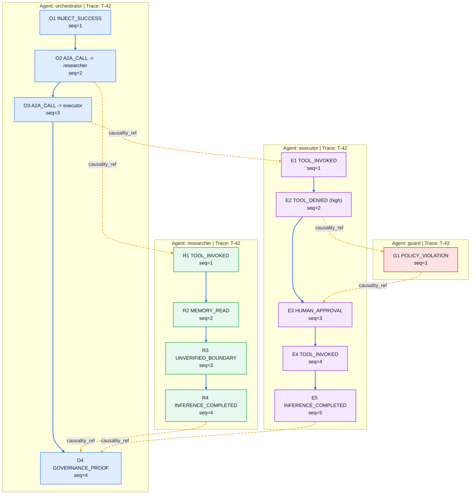

# AIGP Reference Audit Viewer

This document defines a practical baseline for building an AIGP audit viewer that non-technical auditors can use.

## Objectives

1. Reconstruct governance timelines across agents and traces.
2. Verify cryptographic integrity and producer authenticity.
3. Surface policy and profile violations clearly.

## Minimum Features

1. DAG reconstruction from `sequence_number` + `causality_ref`.
2. Event signature verification (`event_signature`, `signature_key_id`).
3. Merkle verification:
   - Full-tree verification with `governance_merkle_tree.resources`.
   - Selective verification with `governance_merkle_tree.inclusion_proofs`.
4. Boundary risk visualization for `UNVERIFIED_BOUNDARY`.
5. Profile compliance checks (for example, signed `high`/`critical` events in regulated profiles).
6. Ordering findings for sequence and causal-link integrity.

## Sequence and Causality Visualization

The viewer SHOULD render ordering in two layers:

- `sequence_number`: in-lane event order for one (`agent_id`, `trace_id`) stream.
- `causality_ref`: cross-lane dependency edges linking one event to its causal predecessor.

Legend:

- Blue solid edges: `sequence_number` ordering checks.
- Orange dashed edges: `causality_ref` dependency checks.
- Node colors: per-agent lanes.

## Verification Report Contract

The viewer SHOULD output a machine-readable report with:

- `run_id`
- `verified_at`
- `total_events`
- `failed_events`
- `signature_failures`
- `merkle_failures`
- `ordering_failures`
- `profile_violations`
- `result` (`pass` | `fail` | `warning`)
- `findings` (stable finding IDs + event context + details)

Recommended schema:

- `schema/aigp-verifier-report.schema.json`

## Recommended UI Views

1. Timeline view: ordered events for one `trace_id`.
2. DAG view: cross-agent causal links.
3. Evidence panel: signature + Merkle proof details for selected event.
4. Findings panel: profile violations grouped by severity.

## Recommended Finding IDs

- `SEQUENCE_GAP`
- `SEQUENCE_DUPLICATE`
- `SEQUENCE_RESET`
- `BROKEN_CAUSAL_REF`
- `SIGNATURE_VERIFICATION_FAILED`
- `MERKLE_ROOT_MISMATCH`
- `INCLUSION_PROOF_INVALID`

## Non-Goals

- Defining a mandatory UI framework.
- Defining a transport protocol.
- Replacing existing SIEM/observability tools.
